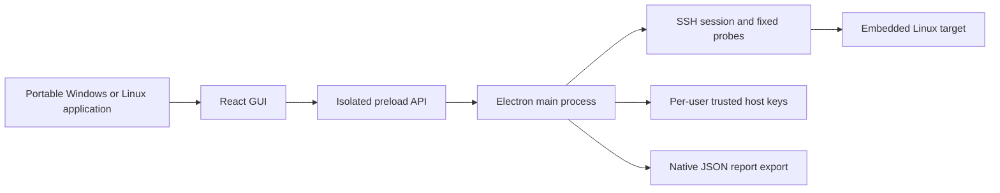

# Architecture and feature roadmap

## Product scope

Diagnostic Hub gives a developer the raw evidence behind a symptom and gives a test engineer a
repeatable collection workflow. SSH over Ethernet/Wi-Fi is the first transport. The Windows 10/11
deliverable is a standalone portable x64 executable; Linux x86_64 has an AppImage and portable
archive. The target CPU architecture is independent of the PC architecture.

Compatibility is detected per capability. A distribution name alone cannot establish which tools,
drivers, privileges, procfs/sysfs entries, or vendor interfaces exist. Generic Linux support
therefore means a documented baseline plus explicit unavailable results, followed by adapters for
optional facilities.

## Runtime structure

The renderer has no Node.js access and receives a narrow API. Main-process IPC checks the sending
window/frame and validates connection parameters. Packaged UI resources use a local `app://`
protocol, navigation and new windows are blocked, and external permission requests are rejected.

The SSH session authenticates with an in-memory password or a key chosen through the native file
picker. The desktop reuses one authenticated SSH connection until explicit disconnect or app
closure; Disconnect, target replacement, report import and app closure clear the configured target.
Pausing live updates retains the target for manual refresh or resume. The backend chooses commands
from the fixed catalogue in `shared/diagnostics/probes.ts`. Diagnostic commands use a
non-interactive shell, C locale and standard system utility paths. Output is bounded and rendered as
text.

Terminal opens a separate PTY channel on that same authenticated connection. Its narrow API accepts
validated terminal IDs, bounded byte input, dimensions and output acknowledgments; it does not
expose local shell execution or arbitrary diagnostic exec commands. Commands typed into Terminal use
the connected SSH user's permissions and can modify the target. The shell survives workspace tab
changes and closes on disconnect, target replacement, report import, app exit or update disconnect.
Normal shell exit creates a fresh PTY on the same SSH connection, preserving local history and
discarding queued input. Recovery is scoped to the current connection generation and allows at most
three restarts per ten seconds; PTY refusal and stream errors are not retried. Pending recovery
pauses while input is blocked and is cancelled on disconnect. The fresh shell does not retain its
predecessor's directory, variables or jobs. Terminal-only close and shell-open failure leave SSH
diagnostics usable. Scrollback is limited to 5,000 lines and pending transport data to 256 KiB.
Transcripts are not stored or exported.

Reports include a schema version, source mode, endpoint, username, timestamps, command catalogue,
results and derived findings. The native export uses the backend's collected snapshot. Demo reports
keep their simulated source label. Neither mode includes authentication secrets.

## Baseline capability matrix

| Capability                 | Baseline                                         | Adaptation / limitation                                                                       |
| -------------------------- | ------------------------------------------------ | --------------------------------------------------------------------------------------------- |
| Identity and distribution  | `uname`, `/etc/os-release`                       | `/etc/openwrt_release` fallback; unknown metadata remains explicit                            |
| CPU, uptime, load          | `/proc/cpuinfo`, `/proc/uptime`, `/proc/loadavg` | Load average is not CPU utilization                                                           |
| Memory                     | `/proc/meminfo`                                  | `MemAvailable` and `MemFree` are shown separately; no stress-test budget is inferred          |
| Mounted filesystem usage   | `df -Pk`                                         | `/rom` excluded from low-space findings; this is not NAND geometry or flash-health validation |
| Interfaces and IPv4 routes | `ip`                                             | `ifconfig`, `route`, `/proc/net/route` fallbacks                                              |
| Processes                  | procps `ps aux`                                  | BusyBox `ps` fallback                                                                         |
| Services                   | systemd units                                    | OpenWrt `ubus`/procd, then init-script inventory                                              |
| Logs                       | OpenWrt `logread`                                | systemd `journalctl`, then `dmesg`; permissions can limit evidence                            |

Fallbacks preserve a failure from an installed capability when it is selected. The app does not
treat a failed `ubus`, `journalctl`, `ip`, or `dmesg` call as successful evidence just because
another tool may exist.

## Website and gateway

The browser uses an HTTPS lab gateway instead of native IPC. The gateway reuses the fixed SSH
collector, requires an in-memory bearer token, enforces exact website origins and allowed targets,
and checks administrator-configured host fingerprints. GitHub Pages hosts only the static UI. The
desktop remains independent of the gateway and internet. Website terminal output streams over
authenticated HTTPS with bounded input/resize operations on the existing session and no second SSH
login. See [website modes](website.md) and [gateway deployment](gateway.md).

Hardware discovery uses read-only procfs/sysfs and optional inventory tools, without board profiles.
Functional hardware testing requires separately qualified fixtures and procedures. See
[hardware matrix](hardware.md).

## Delivery milestones

| Milestone                                    | Deliverables                                                                                                                                                 | Acceptance                                                                                                         |
| -------------------------------------------- | ------------------------------------------------------------------------------------------------------------------------------------------------------------ | ------------------------------------------------------------------------------------------------------------------ |
| v0.1 — SSH evidence foundation (implemented) | Dashboard, 36 read-only probes, hardware discovery, website/gateway, local report import, evidence inspector, findings, JSON reports, portable packaging     | Build, loopback SSH tests, GUI tests and native integration smoke test                                             |
| v0.2 — Daily engineering workflow            | Saved non-secret device profiles, multi-device sessions, cancellable collection, CPU utilization/network-rate histories, report comparison, HTML reports     | Explicit connected/stale/offline states, consistent export/import, bounded collections across targets              |
| v0.3 — Network and service diagnosis         | Reachability, DNS, socket inspection, Wi-Fi state, firewall/routing context, systemd/procd adapters, bounded packet captures and optional throughput tests   | Tools/permissions detected; traffic-generating operations selected explicitly; capture cleanup and useful evidence |
| v0.4 — Embedded hardware adapters            | Qualify existing generic hardware discovery; add board-specific decoding, driver/module/interrupt evidence, reset-cause correlation and calibrated telemetry | Vendor and kernel-specific results with precise source evidence; no generic flash-health PASS                      |
| v0.5 — Test engineering                      | Versioned test plans, prerequisites, timed runs, cancellation/recovery, batch reports, separately classified stress and destructive operations               | Reproducible PASS/FAIL criteria validated on actual hardware; recovery tested                                      |
| v1.0 — Qualified portable release            | Signed single-file executable, accessibility/readability polish, qualification matrix, dependency/license manifest, operator guide                           | Windows 10/11 clean-machine and real-device qualification completed                                                |

Serial/UART console and boot-log capture are a later transport milestone after SSH workflows
stabilize. File transfer remains a future feature. Interactive terminal commands are separate from
the read-only diagnostic catalogue and use the existing SSH account's permissions.

Optional features must report their prerequisites: an unavailable `iperf3`, `tcpdump`, `iw`,
`ethtool`, `smartctl`, `mmc`, `mtdinfo`, or vendor utility cannot be silently replaced with a
fabricated result. The app should offer useful baseline evidence even when an optional package is
absent.

## Current limits

Only one desktop collection is active. Desktop SSH stays connected between snapshots, including
while live updates are paused. Disconnect or app closure releases it; a dropped connection requires
explicit reconnection. Live updates default to 30 seconds after each completed collection, with
5/15/30/60-second choices, no overlap, and pause on failure. There is no background retry after a
failed update, transport cancellation, persistent report history, serial console, SFTP, functional
hardware testing or automatic tool installation. A collection runs at most three probes concurrently
and can take up to about 144 seconds after authentication if every command times out. The connection
attempt allows 60 seconds for reachability, host-key confirmation and authentication. Very large
logs can be truncated, and a successful journal query may still expose only the subset allowed to
that account.

Fingerprints are remembered using trust on first use with explicit confirmation. Changed keys are
rejected; recovery requires the operator to verify the new identity and remove the specific trusted
entry. Passwords and key passphrases are not persisted. User data currently uses Electron's per-user
application directory rather than being stored beside the executable.

### Replacing a board at the same SSH address

Desktop host keys are stored in its own application-data `known-hosts.json`, independently of
Windows/WSL OpenSSH `known_hosts`. A matching address/port key reconnects without a prompt. A new
key at a saved endpoint opens an in-app **SSH host key changed** panel, showing saved and received
fingerprints. SSH verification does not open a native modal or disable the operating-system window.
**Cancel verification** (focused by default; Escape also cancels) rejects the handshake and
preserves the saved entry. After verifying the new key, **Trust replacement device** updates only
that endpoint and continues connecting; no manual JSON edit is required. Other saved endpoints are
retained. Unanswered prompts expire after 45 seconds; closing the window or ending the connection
clears pending approval. Replies are tied to a unique handshake ID so old clicks cannot accept a
later key. Host keys can change when boards are swapped or SSH keys are regenerated; they are never
silently replaced.

The website gateway remains pinned to the keys in `HUB_TARGETS_JSON`; the browser cannot replace
those administrative pins. After a verified board/key change, update the relevant gateway entry and
restart the gateway.
