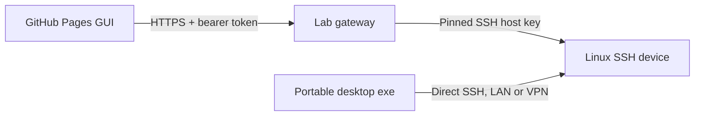

# Lab gateway deployment

The website is a static GitHub Pages application. Live website diagnostics use a **separately
deployed HTTPS gateway on your lab server**. The gateway must have network access to the allowed SSH
devices. The standalone desktop app connects directly and remains usable without internet or this
server.



## Package installation

The source build command `npm run package:gateway` creates
`release/Diagnostic-Hub-Gateway-0.2.0-rc.1.tar.gz`. The Pages workflow also uploads this package as
a build artifact. It contains compiled gateway code, a minimal npm manifest/lock, license,
configuration example and this guide. Node.js 24 is required on the **lab server**, not on desktop
users' PCs.

On the server:

```sh
mkdir diagnostic-hub-gateway
tar -xzf Diagnostic-Hub-Gateway-0.2.0-rc.1.tar.gz -C diagnostic-hub-gateway
cd diagnostic-hub-gateway
npm ci --omit=optional --ignore-scripts
cp .env.gateway.example .env.gateway
chmod 600 .env.gateway
```

Edit `.env.gateway` before starting. Generate a token with
`node -e "console.log(require('node:crypto').randomBytes(32).toString('base64url'))"` and keep it on
the lab server or in your team's credential store. The example token/fingerprint deliberately do not
satisfy startup validation.

```dotenv
HUB_GATEWAY_TOKEN=<random token of at least 32 characters>
HUB_ALLOWED_ORIGINS=https://brucerry.github.io
HUB_TARGETS_JSON=[{"host":"192.168.1.1","port":22,"fingerprint":"SHA256:<verified 43-character fingerprint>"}]
HUB_GATEWAY_HOST=127.0.0.1
HUB_GATEWAY_PORT=8787
```

Origin values contain the scheme and hostname only. GitHub Pages' `/embedded-linux-diagnostic-hub/`
repository path is not part of the origin. Multiple origins can be comma-separated, with no
wildcard. Device allowlist entries match the exact hostname/IP and port used in the GUI. Every entry
requires the expected negotiated OpenSSH SHA256 host fingerprint.

Obtain fingerprints from a trusted device console or provisioning record. On OpenSSH systems,
`ssh-keygen -lf /etc/ssh/ssh_host_ed25519_key.pub -E sha256` displays the public host-key
fingerprint. On OpenWrt/Dropbear, use `dropbearkey -y -f <active-host-key-file>` through a trusted
console. Select the fingerprint for the key algorithm negotiated by the gateway. A changed key
requires verified administrator configuration updates; the browser cannot override a pinned key.

Start the packaged gateway:

```sh
npm start
```

When running from the full source repository, use `npm run gateway` instead. Run under a dedicated
service account and your normal service supervisor for persistent operation. No device passwords are
stored in `.env.gateway`.

## HTTPS front end

Use the lab's HTTPS reverse proxy and a certificate trusted by the engineers' browsers. The included
`gateway/Caddyfile.example` is a starting point for a server whose DNS and certificate issuance are
already configured:

```caddyfile
gateway.example.com {
    reverse_proxy 127.0.0.1:8787 {
        transport http {
            response_header_timeout 180s
        }
    }
}
```

Public ACME certificate issuance needs the applicable DNS/challenge reachability. Internal lab
domains can use a corporate CA or an existing HTTPS proxy. Preserve the `Origin` and `Authorization`
headers, keep SSH devices on the intended private network, and allow enough proxy time for a
complete snapshot. The collector runs at most three checks at a time; 36 checks can take up to about
144 seconds if every command reaches its 12-second timeout.

## Device clock

`POST /api/sessions/<id>/clock` reads system date/time, effective timezone and optional boot/uptime
metadata on a separate SSH exec channel. It accepts no request body and requires the same bearer,
Origin and pinned-session policy as diagnostics. A read is limited to five seconds and 8 KiB, with
one in flight per session; cancellation closes only the clock query. The website requests it once
per minute and on connection/resume/reset activity, independently of diagnostic collection.

Minimal devices can return unavailable time or unknown timezone metadata. An older gateway without
this route leaves the clock unavailable while diagnostics and the terminal remain usable. Clock
responses are transient UI state and are excluded from diagnostic reports.

## Terminal streaming

Deploy the updated gateway together with a website build that provides Terminal. A terminal reuses
the authenticated SSH session and its pinned host key. Commands run with the connected account's
permissions; the gateway's automatic diagnostic probes remain read-only.

`POST /api/sessions/<session>/terminal` opens one PTY and returns a streamed `application/x-ndjson`
response. The request contains a terminal ID and rows/columns. Input and resize use authenticated
POST routes under `terminal/<id>/input` and `terminal/<id>/resize`; DELETE of `terminal/<id>` closes
only the shell. All routes require the bearer header and an allowed Origin. No token is placed in a
URL. Stream abort, session expiry/deletion and gateway shutdown release the PTY. Output keepalives
do not extend abandoned sessions; the existing browser heartbeat does.

Preserve Origin/Authorization headers, disable proxy response buffering and allow long-lived
responses. For Caddy, add `flush_interval -1` inside `reverse_proxy`; for nginx, configure
`proxy_buffering off` and an idle read timeout longer than the 15-second stream keepalive interval.
The gateway also returns no-store/no-transform and `X-Accel-Buffering: no` headers.

Terminal input/resize has its own per-session limit of 60 requests/second with a burst of 120 and a
256 KiB/second input ceiling. Input frames are limited to 16 KiB; dimensions are 2–500 columns and
1–300 rows. Pending output is bounded to 256 KiB with a 30-second stalled-consumer timeout. Capacity
errors close only the terminal and are shown in the workspace. The existing 120/minute control-route
budget still applies to session management and diagnostic operations.

The Node service binds loopback by default and provides HTTP behind the HTTPS proxy. The website
rejects an HTTP gateway in production. HTTP loopback is permitted for local development only.

Do not put access tokens, device passwords or private keys in the GitHub repository, Actions
artifacts, Pages build variables or public website URLs. The website asks for its gateway token
interactively and keeps it in memory until the session/view is discarded. Browser report import
stays local and makes no report upload.

## Docker alternative

From the source checkout:

```sh
docker build -f gateway/Dockerfile -t diagnostic-hub-gateway .
docker run --rm --name diagnostic-hub-gateway \
  --env-file .env.gateway \
  -e HUB_GATEWAY_HOST=0.0.0.0 \
  -p 127.0.0.1:8787:8787 \
  diagnostic-hub-gateway
```

The container runs as a non-root user. Put your HTTPS proxy in front of the loopback-mapped port.
Network routing from the container must reach the device addresses; test that routing in your lab.
Docker image builds have not replaced an actual deployment test on your server.

## Browser workflow

1. Open the published website and choose **Connect device**.
2. Enter the gateway HTTPS URL, access token, allowlisted target address/port, SSH username, and
   either a password or a selected SSH private-key file (with its passphrase if encrypted).
3. Choose **Read fingerprint**. The gateway obtains the key before authentication and requires it to
   match its configured pin.
4. Compare with a trusted source and check the fingerprint verification box.
5. Connect and collect. Export JSON reports in the browser or open a report previously saved by the
   desktop app.
6. Disconnect when finished. The page sends an authenticated heartbeat every minute, keeping the SSH
   session alive while updates are paused. Page exit sends a best-effort authenticated DELETE with
   fetch keepalive; missed close notifications and browser crashes are handled by the ten-minute
   idle expiry. See
   [fetch keepalive](https://developer.mozilla.org/en-US/docs/Web/API/Request/keepalive).

Website gateway authentication uses a shared team bearer token. Device SSH supports passwords and
private keys, including encrypted PEM/OpenSSH keys supported by the SSH library. Private-key files
are capped at 64 KiB. The browser sends the selected key and optional passphrase to the trusted
HTTPS gateway only when connecting; discovery sends no device credentials. The gateway keeps
credentials in memory during authentication, clears its key buffer afterward, and stores neither
keys nor passphrases in session records, reports, or configuration. Use your established HTTPS
reverse proxy without request-body logging.

The verification checkbox becomes available after **Read fingerprint** succeeds. Compare the
displayed fingerprint with a trusted source before checking it. Editing the target, gateway address
or token clears verification. Browser confirmation cannot override the gateway's configured pin.

Per-user SSO/RBAC, server-managed key provisioning, session audit records and token rotation
workflows are future production milestones. The gateway is a lab service, rather than a public
multi-tenant SSH proxy.

## Validation and API contract

Core tests use real loopback SSH to verify token/origin rejection, target allowlists, configured
host fingerprints, credential-free fingerprint discovery, collection and disconnect. Browser tests
exercise the entire GUI → HTTP gateway → SSH path. Validate HTTPS, DNS, firewall/VPN routing and the
intended Linux target on your lab server before claiming deployment completion.

All API routes require an allowed `Origin` and `Authorization: Bearer <token>` except an
allowed-origin CORS preflight. Routes are `GET /api/health`, `POST /api/fingerprint`,
`POST /api/sessions`, `POST /api/sessions/<id>/snapshot`, `POST /api/sessions/<id>/clock`,
`POST /api/sessions/<id>/heartbeat`, and `DELETE /api/sessions/<id>`. Connection requests use
`host`, `port`, `username`, `auth` and `expectedFingerprint`. For `auth: password`, supply
`password`; for `auth: key`, supply the private-key text as `privateKey` and an optional
`passphrase`. Requests are capped at 512 KiB, authenticated calls at 120/minute for the team token,
and active/connecting sessions at eight. Responses and reports omit SSH authentication secrets.
